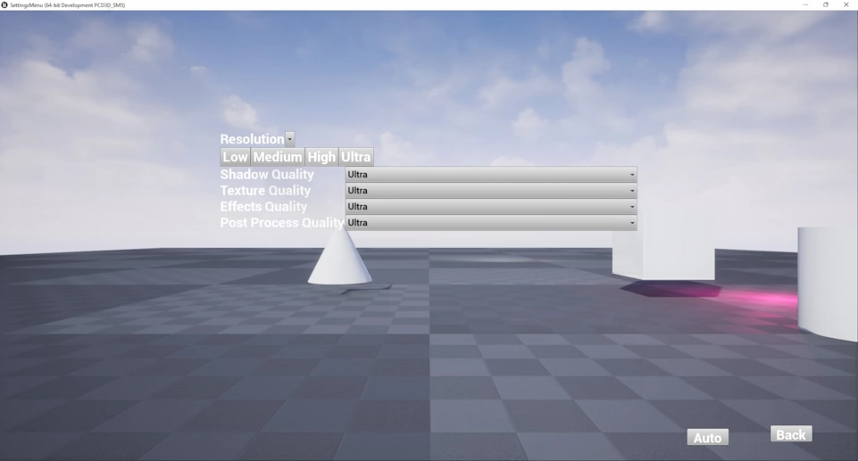

# SettingsMenu

Unreal Engine settings menu

## Features

- Change resolution
- Change between Low, Medium, High, Ultra
- Shadow Quality
- Texture Quality
- Effects Quality
- Post Processing Quality
- Auto quality
